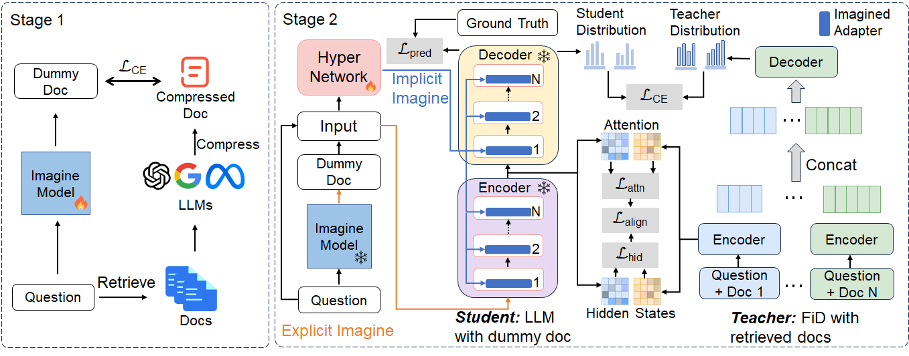

# 📄 IAG


      
The official repository of the paper [Imagination Augmented Generation: Learning to Imagine Richer Context for Question Answering over Large Language Models]().


## 🎓 IAG Overview

Imagination Augmented Generation (IAG) is a novel framework designed to enhance the knowledge utilization of Large Language Models (LLMs) for question answering tasks. IAG simulates the human capacity to compensate for knowledge deficits through imagination, without relying on external resources. This method is particularly useful for knowledge-intensive tasks where LLMs often lack the sufficient capability to handle independently. The architecture of the proposed ImcQA is shown in the following figure.



## 🚀 Quick Start

```bash
bash scripts/run.sh
```

## 📝 Quick Links

- [📄 IAG](#-iag)
  - [🎓 IAG Overview](#-iag-overview)
  - [🚀 Quick Start](#-quick-start)
  - [📝 Quick Links](#-quick-links)
  - [🛠 Requirements](#-requirements)
  - [💡 Data](#-data)
  - [⚡️ Code Structure](#️-code-structure)
  - [👨‍💻 Training](#-training)
  - [🤝 Referencing and Citing](#-referencing-and-citing)

## 🛠 Requirements

Please install the 1.13.1 versions of PyTorch (`torch`) by following the [official installation instructions](https://pytorch.org/get-started/locally/).
You can install the requirements with `pip install --r requirements.txt`.
You can refer to the [Dockerfile](./Dockerfile) for setting up the environment.
We tested the code with `python==3.8`, `torch==1.13.1`, `accelerate==0.24.0`, `transformers==4.23.1`, `pytorch_lightning==1.6.3`, and CUDA version 11.7.

## 💡 Data

To obtain the training and evaluation data, please refer to the official websites: [NQ/TriviaQA/WebQ](https://github.com/facebookresearch/DPR)
Please put them into `data` folder.

To get the pretraining data of Imagine Model, you can refer to the `data/compress.py` and [LongLLmlingua](https://github.com/microsoft/LLMLingua) for compressed data.

## ⚡️ Code Structure

* `main.py`: train ImcQA
* `test.py`: test ImcQA
* `ft_llama/`: folder that conteins finetuning llama files
* `model/`: folder that conteins model files
* `config/`: folder that contains all config files

## 👨‍💻 Training

Training consists of two stage: a pretraning stage and the finetune stage. 
You can change the path of these arguments for your own system.

<!-- ## 👉 👨‍💻📦💡📝 Papers | ⚡️ Playground | 🛠 Prompt Engineering | 🌍 ChatGPT Prompt ｜ ⛳ LLMs Usage Guide -->

## 🤝 Referencing and Citing 

If you find our work useful in your research and would like to cite our project, please use the following citation: found this work useful, please consider giving this repository a star and citing our paper as follows:
```
None
```
